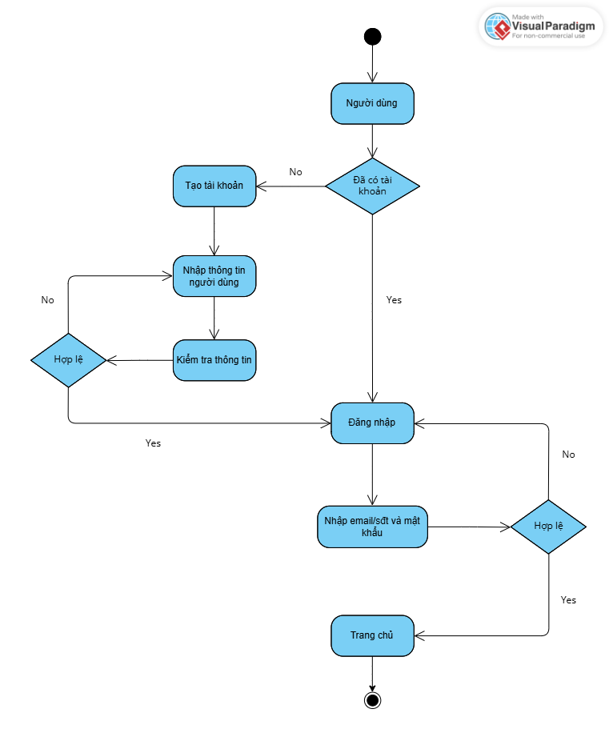
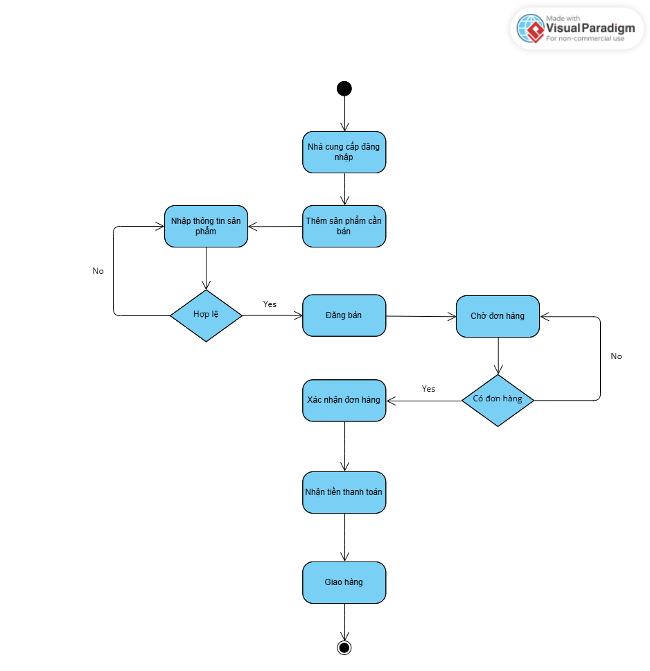

## OOP_NO1_Term3_2025_K17_Group5

# Group5

Member:

Nguyễn Văn Annn
Github id: Ansociuu

Phan Văn Phát
Github id: dodorafust

Trịnh Thị Lan Nhi
Github id: lannhi07

Nguyễn Lệ Thu
Github id: nglthu


- Nhật kí tạm thời: 
  + 9/5: họp online để thống nhất và mô phỏng dự án. Thảo luận bài tập 1.
  + 10/5: làm được 1/3 bài tập 1 và tiếp tục phần còn lại. Dự kiến 12h trưa mai hoàn thành bài tập.

### Câu 1: Tiêu đề của bài tập lớn cuối kỳ: Hệ thống mua bán hàng trực tuyến shopbee.

### Câu 2: Phân tích 4 đối tượng bao gồm: user, product, order, payment

I. Đối tượng người dùng (user):
1. Miêu tả thông tin của người dùng:
 + Mã người dùng
 + Tên người dùng
 + Giới tính
 + Ngày sinh
 + Số điện thoại
 + Email
 + Địa chỉ
 + Mật khẩu
 + Loại người dùng (Khách hàng/Nhà cung cấp)
2. Phương thức hoạt động liên quan đến đối tượng người dùng:
 + Đăng kí tài khoản, đăng nhập (bằng sdt, email)
 + Hiển thị thông sinh người dùng
 + Mua sản phẩm, thanh toán (khách hàng)
 + Đăng bán sản phẩm (nhà cung cấp)

II. Đối tượng sản phẩm (product):
1. Miêu tả thông tin của sản phẩm:
 + Mã sản phẩm
 + Mã người bán (nhà cung cấp)
 + Tên sản phẩm
 + Giá sản phẩm
 + Số lượng sản phẩm
 + Mô tả sản phẩm
2. Phương thức hoạt động liên quan đến đối tượng sản phẩm:
 + Hiển thị thông tin sản phẩm
 + Cập nhật số lượng sản phẩm (sau khi mua bán)

III. Đối tượng đơn hàng (order):
1. Miêu tả thông tin của đơn hàng:
 + Mã đơn hàng
 + Mã người dùng (khách hàng)
 + Danh sách sản phẩm (tên, số lượng, giá)
 + Tổng tiền
 + Ngày đặt hàng
 + Trạng thái đơn hàng (chờ xác nhận, đang giao, đã nhận, đã hủy)
2. Phương thức hoạt động liên quan đến đối tượng đơn hàng:
 + Tạo đơn hàng mới (khi khách hàng mua)
 + Hiển thị thông tin đơn hàng
 + Cập nhật trạng thái đơn hàng
 + Tính tổng số tiền

IV. Đối tượng thanh toán (payment):
1. Miêu tả thông tin của thanh toán:
 + Mã thanh toán
 + Mã đơn hàng
 + Số tiền thanh toán
 + Phương thức thanh toán (tiền mặt, ví điện tử)
 + Trạng thái thanh toán (đã thanh toán, chưa thanh toán)
 + Ngày thanh toán
2. Phương thức hoạt động liên quan đến đối tượng thanh toán:
 + Thực hiện thanh toán
 + Hiển thị thông tin thanh toán
 + Cập nhật phương thức thanh toán
 + Cập nhật trạng thái thanh toán

### Câu 3: Cấu trúc folder

### 📁 Cấu trúc thư mục Project

```plaintext
Project/
├── .vscode/
├── bin/
├── src/
│   ├── Customer.java
│   ├── Main.java
│   ├── Order.java
│   ├── Payment.java
│   ├── Product.java
│   ├── Seller.java
│   └── User.java
├── test/
│   ├── TestOrder.java
│   ├── TestPayment.java
│   ├── TestProduct.java
│   └── TestUser.java
├── README.md

```


### Câu 4: 
  Chúng em viết 7 class cho 4 đối tượng xác định được ở câu 2 (bao gồm main). 
- Với đối tượng user ta có: class user, class customer và class seller. Customer và seller kế thừa user. 
- Với đối tượng product ta có: class product 
- Với đối tượng order ta có: class order
- Với đối tượng payment ta có: class payment

(Các chức năng cơ bản tương tự câu 2)


### Câu 5:

Để kiểm tra tính đúng đắn và ổn định của lớp User, Customer và Seller, chúng tôi thực hiện kiểm thử cho các chức năng chính sau:
  - Đăng kí, hiển thị thông tin, đăng nhập, mua (của customer) và bán (của seller).

Để kiểm tra tính đúng đắn và ổn định của lớp Product, chúng tôi thực hiện kiểm thử cho các chức năng chính sau:
  - Tạo, hiển thị và cập nhật số lượng sản phẩm, xử lý lỗi khi số lượng sản phẩm không đủ và hiển thị lại thông tin sản phẩm sau khi cập nhật.

Để kiểm tra tính đúng đắn và ổn định của lớp Order, chúng tôi thực hiện kiểm thử cho các chức năng chính sau:
  - Tạo hóa đơn mới, hiển thị thông tin đơn hàng, cập nhật trạng thái và hiển thị lại đơn hàng để kiểm tra. 
    
Để kiểm tra tính đúng đắn và ổn định của lớp Payment, chúng tôi thực hiện kiểm thử cho các chức năng chính sau:
  - Tạo, hiển thị và cập nhật thanh toán, cập nhật phương thức thanh toán, kiểm tra trạng thái thanh toán chưa hoàn tất.

---
## Nội dung

Xây dựng ứng dụng mua bán hàng trực tuyến Shopbee

Yêu cầu:
- Giao diện Java Spring Boot.
- Có chức năng quản lý người dùng, sản phẩm, đơn hàng và thanh toán.
- Và các chức năng khác.

Cụ thể: 
- Có chức năng quản lí người dùng (user)
  + Thêm, sửa, xóa người dùng 
  + Liệt kê thông tin về người dùng, có thể lọc ra các người dùng theo 2 loại: khách hàng (customer), nhà cung cấp (seller)
    
- Có chức năng quản lý sản phẩm (product)
  + Thêm, sửa, xóa sản phẩm
  + Hiển thị thông tin sản phẩm
  + Cập nhập số lượng sản phẩm
  + Gán sản phẩm cho nhà cung cấp và đơn hàng

- Có chức năng quản lý đơn hàng (order)
  + Thêm, sửa, xóa đơn hàng
  + Hiển thị thông tin đơn hàng
  + Cập nhập trạng thái đơn hàng
  + Tính tổng số tiền
  + Gán đơn hàng cho khách hàng và thanh toán
  
- Có chức năng quản lý thanh toán (payment)
  + Thực hiện thanh toán
  + Hiển thị thông tin thanh toán
  + Cập nhật phương thức thanh toán
  + Cập nhật trạng thái thanh toán

- Dữ liệu được lưu trữ xuống file nhị phân
  + Cần tạo các lớp liên quan đến người dùng, sản phẩm, đơn hàng và thanh toán để đọc, ghi xuống 1 hay nhiều file.

- Khi làm việc với dữ liệu trong bộ nhớ, dữ liệu cần được lưu trữ dưới dạng các Collection tùy chọn như ArrayList, LinkedList, Map, ....
## Class Diagram 

## Activity Diagram
#### 1. Đăng nhập



#### 2. Mua hàng


#### 3. Bán hàng


<table>
  <tr>
    <td align="center" width="33%">
      <br/>
      <em>Thêm</em>
    </td>
    <td align="center" width="33%">
      <br/>
      <em>Sửa</em>
    </td>
    <td align="center" width="33%">
      <br/>
      <em>Xóa</em>
    </td>
  </tr>
</table>

## Chức năng chính
 thông báo danh sách đơn hàng đã thanh toán bởi khách hàng cụ thể

Lưu đồ thuật toán


## Phân công công việc

| Thành viên |              Nhiệm vụ              |
|------------|------------------------------------|
| An         |In danh sách đơn hàng của khách hàng| 
| Nhi        |kiểm thử chức năng tổng thể         |
| Phát       | kiểm tra đơn hàng đã thanh toán    |


